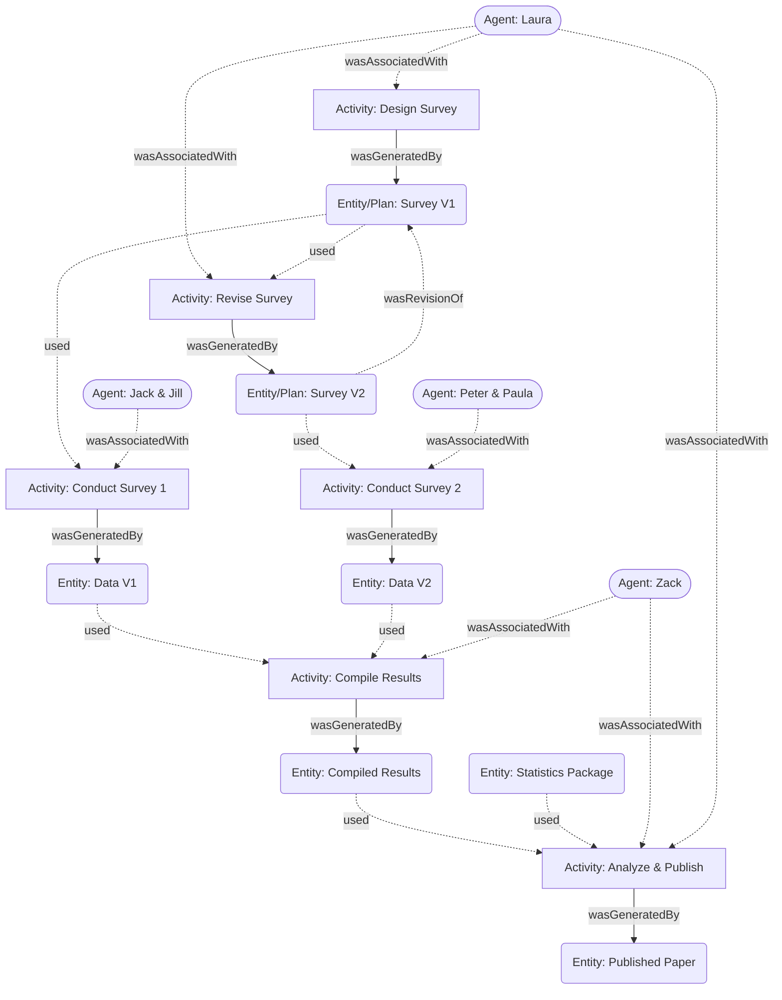

```mermaid
graph TD
    %% Agents
    Laura([Agent: Laura])
    JackJill([Agent: Jack & Jill])
    PeterPaula([Agent: Peter & Paula])
    Zack([Agent: Zack])

    %% Activities
    Act1[Activity: Design Survey]
    Act2[Activity: Conduct Survey 1]
    Act3[Activity: Revise Survey]
    Act4[Activity: Conduct Survey 2]
    Act5[Activity: Compile Results]
    Act6[Activity: Analyze & Publish]

    %% Entities
    Ent1(Entity/Plan: Survey V1)
    Ent2(Entity: Data V1)
    Ent3(Entity/Plan: Survey V2)
    Ent4(Entity: Data V2)
    Ent5(Entity: Compiled Results)
    Ent6(Entity: Statistics Package)
    Ent7(Entity: Published Paper)

    %% Relationships
    Laura -.->|wasAssociatedWith| Act1
    Act1 -->|wasGeneratedBy| Ent1
    
    Ent1 -.->|used| Act2
    JackJill -.->|wasAssociatedWith| Act2
    Act2 -->|wasGeneratedBy| Ent2
    
    Laura -.->|wasAssociatedWith| Act3
    Ent1 -.->|used| Act3
    Act3 -->|wasGeneratedBy| Ent3
    Ent3 -.->|wasRevisionOf| Ent1
    
    Ent3 -.->|used| Act4
    PeterPaula -.->|wasAssociatedWith| Act4
    Act4 -->|wasGeneratedBy| Ent4
    
    Ent2 -.->|used| Act5
    Ent4 -.->|used| Act5
    Zack -.->|wasAssociatedWith| Act5
    Act5 -->|wasGeneratedBy| Ent5
    
    Ent5 -.->|used| Act6
    Ent6 -.->|used| Act6
    Zack -.->|wasAssociatedWith| Act6
    Laura -.->|wasAssociatedWith| Act6
    Act6 -->|wasGeneratedBy| Ent7
```
